  

Before this I was a Product Analyst at slice Small Finance Bank, and I studied materials engineering at IIT Jodhpur, where a Bi-GAN I built for lattice structure identification later turned into a market-risk stress-testing model.

## Featured work

| Project | What it is |
|---|---|
| [crowdlens](https://github.com/Niyathnair/crowdlens) | Simulates a population of audience personas to stress-test campaign copy before it ships |
| [clif-gpt](https://github.com/Niyathnair/clif-gpt) | Couples a frozen LLM with an object-centric video dynamics branch for physics-grounded completions |
| [startup-builder-agents](https://github.com/Niyathnair/startup-builder-agents) | FastAPI service of agents that turn a startup idea into market research, branding, a business model and financial estimates |
| [research-paper-rag](https://github.com/Niyathnair/research-paper-rag) | Query research papers with LLaMA-2 and retrieval-augmented generation |
| [market-risk-bigan](https://github.com/Niyathnair/market-risk-bigan) | Market risk analysis and stress testing with bidirectional GANs |
| [curvetopia-curve-regularization](https://github.com/Niyathnair/curvetopia-curve-regularization) | Regularity, symmetry and occlusion handling for 2D curves (Adobe GenSolve) |

## More of what I work on

- **LLMs and text-to-SQL**: [antiks-text-to-sql](https://github.com/Niyathnair/antiks-text-to-sql)
- **ML and forecasting**: [churn-prediction-sagemaker](https://github.com/Niyathnair/churn-prediction-sagemaker), [rohlik-orders-forecasting](https://github.com/Niyathnair/rohlik-orders-forecasting)
- **NLP**: [aspect-based-sentiment-analysis](https://github.com/Niyathnair/aspect-based-sentiment-analysis), [vader-vs-roberta-sentiment](https://github.com/Niyathnair/vader-vs-roberta-sentiment), [fake-news-lstm-classifier](https://github.com/Niyathnair/fake-news-lstm-classifier)
- **Numerical computing**: [floating-point-summation](https://github.com/Niyathnair/floating-point-summation)

## Toolbox

Python · PyTorch · SQL · Rust · TypeScript · FastAPI · AWS SageMaker

## Writing

I write about research at [The Multiverse of Intelligence](https://blog-one-xi-62.vercel.app).
